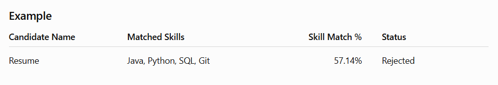

# AI-Powered Resume Screening Bot

A UiPath-based RPA solution that automates resume screening using OCR, skill matching, candidate classification, and Excel automation.

## 📌 Project Overview

The AI-Powered Resume Screening Bot automates the initial screening of candidate resume PDF files against predefined job requirements.

The bot uses OCR to extract resume content, matches required technical skills, calculates a skill-match percentage, classifies candidates as shortlisted or rejected, and generates a structured Excel screening report.

## 🚀 Key Features

- 📄 Reads candidate resume PDF files automatically
- 🔍 Extracts resume text using OCR
- 🧠 Matches required skills against resume content
- 📊 Calculates skill-match percentage
- 🎯 Classifies candidates based on a predefined threshold
- 📑 Creates structured screening results using a DataTable
- 📗 Automatically writes screening results into Excel
- 📁 Automatically moves resumes into `Shortlisted` or `Rejected` folders
- 🔄 Supports processing multiple resumes from an input folder
- 📂 Uses relative project paths for improved portability

## 🛠️ Technologies Used

- **UiPath Studio**
- **RPA (Robotic Process Automation)**
- **OCR**
- **Microsoft Excel**
- **VB.NET Expressions**
- **DataTables**
- **PDF Processing**

## 🔄 Workflow

```text
Resume PDF
     ↓
Read PDF with OCR
     ↓
Extract Resume Text
     ↓
Match Required Skills
     ↓
Calculate Skill Match %
     ↓
Shortlist / Reject Candidate
     ↓
Move Resume to Appropriate Folder
     ↓
Add Results to DataTable
     ↓
Write DataTable to Excel
     ↓
ResumeScreeningResults.xlsx
```

## 📋 Screening Fields

| Field | Description |
|---|---|
| Candidate Name | Name derived from the resume filename |
| Matched Skills | Required skills identified in the resume |
| Skill Match % | Percentage of required skills matched |
| Status | Shortlisted or Rejected |

 Required Skills

The current implementation evaluates resumes against the following skills:

- Java
- Python
- SQL
- Git
- Object-Oriented Programming
- Data Structures
- REST APIs

Screening Threshold
| Skill Match % | Result |
|---|---|
| 60% or above | Shortlisted |
| Below 60% | Rejected |

## 📂 Project Structure

```text
AI-Powered Resume Screening Bot/
│
├── Main.xaml
├── project.json
├── project.uiproj
├── entry-points.json
│
├── .objects/
├── .project/
├── .settings/
├── .tmh/
│
├── Input/
│   └── Resume PDF files
│
├── Job Description/
│   └── JobDescription.txt
│
├── Output/
│   └── ResumeScreeningResults.xlsx
│
├── Shortlisted/
│   └── Successfully shortlisted resumes
│
└── Rejected/
    └── Rejected resumes
```

## ⚙️ Requirements & Setup

Before running the project, make sure the following are installed:

- **UiPath Studio**
- **UiPath PDF Activities**
- **UiPath Excel Activities**
- **Windows**
- A resume PDF file for testing

## 📥 Setup

- Clone this repository: `git clone https://github.com/SciddhantoSinha/AI-Powered-Resume-Screening-Bot.git`
- Open the cloned project in **UiPath Studio**.
- Restore/install the required UiPath packages if prompted.
- Place candidate resume PDF files inside the `Input` folder.
- Ensure the job requirements are available in `Job Description/JobDescription.txt`

## ▶️ How to Run

- Open the project in **UiPath Studio**.
- Place resume PDF files inside the `Input` folder.
- Open `Main.xaml`.
- Run the workflow.
- The bot reads the invoice using OCR.
- Required skills are matched against the extracted resume text.
- The skill-match percentage is calculated.
- Candidates with a match of 60% or above are shortlisted.
- Candidates below 60% are rejected.
- Resumes are moved into their respective folders.
- The screening results are written to an Excel workbook.

## 📊 Sample Output

The bot converts the extracted invoice information into structured Excel data.

### Example


## 🎯 Use Case
The automation can be used to reduce repetitive manual resume-screening tasks in organizations that need to evaluate multiple candidates against predefined job requirements.

By automatically extracting resume content, matching required skills, and organizing candidate results, the solution can streamline the initial screening stage.

## 💡Benefits
- Reduces repetitive manual resume screening
- Automates resume information extraction
- Converts unstructured PDF resume content into structured results
- Provides consistent skill-based candidate screening
- Simplifies Excel-based screening reports
- Automatically organizes shortlisted and rejected resumes
- Provides a reusable RPA workflow for recruitment automation

## 🔐 Error Handling

The project uses separate folders for handling resume screening outcomes:

- `Shortlisted` — resumes meeting the 60% or higher skill-match threshold
- `Rejected` — resumes below the 60% skill-match threshold

## 👨‍💻 Author

**Sciddhanto Sinha**

B.Tech – Computer Science Engineering (AI & Analytics)
